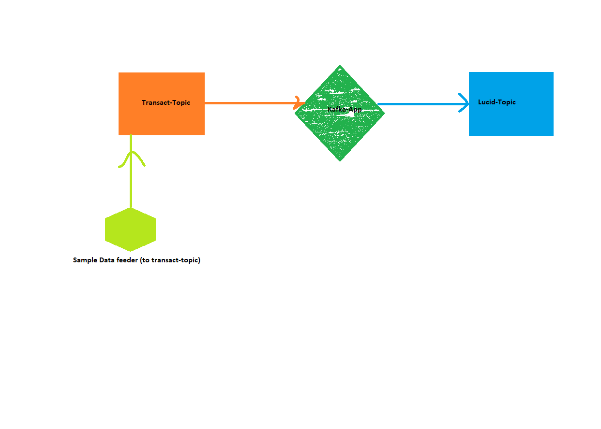

### Problem-1

while connecting Confluent Kafka (which is installed in windows using WSL), when I tried to connect to the Kafka Broker 
running under WSL2, from the IntelliJ Java application running on Windows. Broker was not able to connect.

### Solution:-
In such a case, the solution is to disable IPv6 in WSL2 for this to work properly.
WSL2 currently has a networking issue that prevents outside programs to connect to Kafka running on WSL2 (for example your Java programs, Conduktor, etc...); 
To fix this, we recommend disabling IPv6 on WSL2. Your Windows password will be prompted on the first command:
```sh
sudo sysctl -w net.ipv6.conf.all.disable_ipv6=1
sudo sysctl -w net.ipv6.conf.default.disable_ipv6=1
```
https://www.conduktor.io/kafka/how-to-install-apache-kafka-on-windows/

### Problem-2
Also, observed below error during confluent kafka services(Long run) :

> Connection to node -1 (localhost/127.0.0.1:9092) could not be established. 
> Broker may not be available.

### Solution:- 
Restart(stop/start) the services
```sh
confluent local services stop/start
```

### Problem-3
Also, observed error disconnected error during confluent kafka

### Solution:-
check server.properties, where **listeners=PLAINTEXT://localhost:9092** should look like this. this could be due to below command:-

`confluent local destroy` (need to verify)

### Problem-4
To deal with Idle time Kafka server disconnection in clients application

### Solution:-
Also `connections.max.idle.ms = 540000` this has to be increased, so that kafka becomes not deactivate after 9min idle time.
